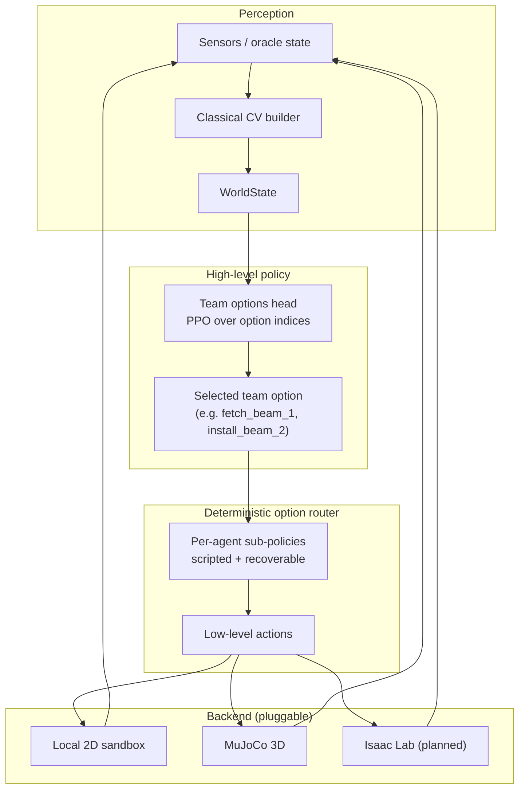
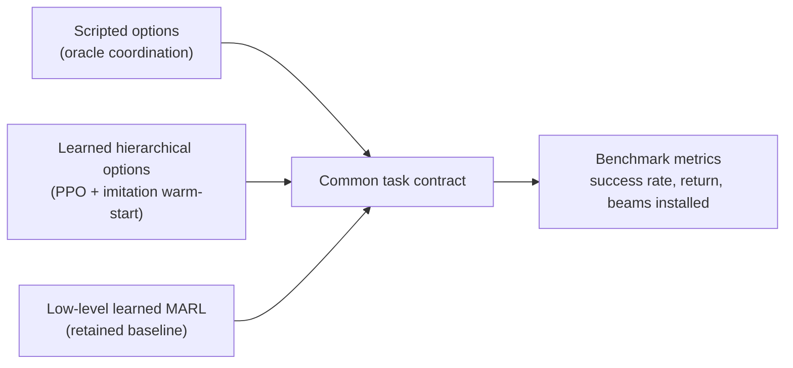

# Architecture Overview — Embodied Skill Composer

This page complements the README with a visual map of how perception,
planning, option execution, and learning fit together for the two-robot
collaborative-assembly flagship.

## Hierarchical control stack

## Policy ladder for benchmarking

## Why hierarchical options

The retained low-level MARL baseline stalls at 1/2 beams in the default task,
while the hierarchical options policy clears 2/2 beams reliably. Promoting
the team-option abstraction out of scripted code and into the learned head
is what closes that gap. The pluggable backend layer keeps the same task
contract whether the rollout runs in the local 2D sandbox, MuJoCo, or a
future Isaac Lab build.

## Where to look in the code

| Path | Responsibility |
| --- | --- |
| `src/embodied_skill_composer/assembly/` | Task contract, backend selection, scripted oracle, learners |
| `src/embodied_skill_composer/perception/` | Oracle and classical-CV world-state builders |
| `src/embodied_skill_composer/sim/` | Tabletop and warehouse adapters |
| `src/embodied_skill_composer/rl/` | Pickup-policy training scaffolding |
| `scripts/train_assembly_options.py` | Hierarchical options training entrypoint |
| `scripts/benchmark_assembly_policies.py` | Cross-policy benchmark runner |
| `configs/assembly_profiles/` | Runtime profiles (CPU, local GPU, MuJoCo, Isaac stub) |
