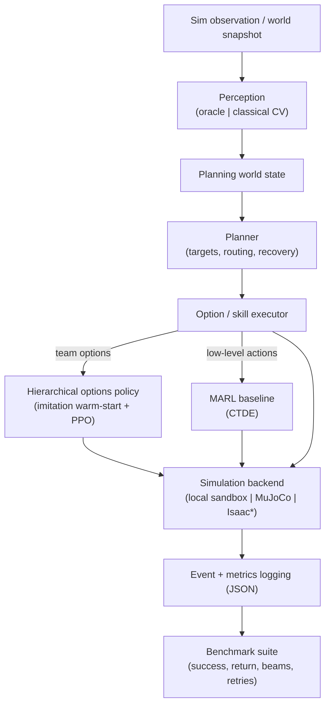

# Architecture

Embodied Skill Composer is a **hybrid** robotics stack: explicit perception and
planning wrap selectively-applied reinforcement learning, so the system stays
inspectable and benchmarkable instead of collapsing into one opaque reactive
policy. This document explains how the pieces fit together and where to look in
the source tree.

## High-level flow

`*` Isaac Lab is a planned backend; the task contract is kept backend-agnostic
so it can be added without touching task semantics.

## Components

| Layer | Package | Responsibility |
| --- | --- | --- |
| Perception | `src/embodied_skill_composer/perception/` | Turn sensor/sim observations into a structured planning world state. Supports an **oracle** mode and a **classical CV** mode. |
| Planning | `src/embodied_skill_composer/core/` | Planner, executor, interfaces, shared models, skills, and logging. Decides remaining targets, routing, and recovery. |
| Assembly | `src/embodied_skill_composer/assembly/` | Two-robot collaborative-assembly task contract, backend selection, scripted option oracle, benchmark helpers, and learners. |
| RL | `src/embodied_skill_composer/rl/` | Lightweight learned pickup-policy scaffolding and the option-level learners. |
| Simulation | `src/embodied_skill_composer/sim/` | Tabletop and warehouse adapters; the MuJoCo backend reuses the same task contract. |
| Pipelines | `src/embodied_skill_composer/pipelines/` | Higher-level collection / episode orchestration. |
| Tasks | `src/embodied_skill_composer/tasks/` | YAML task loading. |

## Why hybrid, not end-to-end RL

- **Perception** converts observations into a planning world state.
- **Explicit planning** decides which targets remain, where to go next, and how
  to recover — deterministic and debuggable.
- **Structured option execution** keeps the collaborative-assembly task
  inspectable and benchmarkable.
- **RL** is applied only where learning adds value (option selection, pickup
  policy), rather than forcing the whole stack into one reactive policy.

## Flagship result

Learned hierarchical team options solve the default `2/2 beams` assembly task
and match the scripted option oracle, while the retained low-level MARL baseline
stalls at `1/2 beams`. See
[results/assembly-hierarchical-options.md](results/assembly-hierarchical-options.md)
for the write-up and the project README for the command-by-command run matrix.

## Runtime profiles

| Profile | Purpose |
| --- | --- |
| `configs/assembly_profiles/local_dev.yaml` | CPU regression baseline (default) |
| `configs/assembly_profiles/local_gpu.yaml` | Local GPU torch/CUDA validation |
| `configs/assembly_profiles/mujoco_local.yaml` | MuJoCo 3D visual simulation |
| `configs/assembly_profiles/isaac_gpu.yaml` | Planned Linux + NVIDIA Isaac profile |
